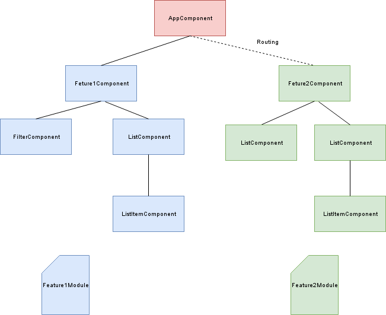

# JobroomWorkshop

This project was generated with [Angular CLI](https://github.com/angular/angular-cli) version 1.1.2.

## Development server

Run `ng serve` for a dev server. Navigate to `http://localhost:4200/`. The app will automatically reload if you change any of the source files.

## Code scaffolding

Run `ng generate component component-name` to generate a new component. You can also use `ng generate directive|pipe|service|class|module`.

## Build

Run `ng build` to build the project. The build artifacts will be stored in the `dist/` directory. Use the `-prod` flag for a production build.

## Running unit tests

Run `ng test` to execute the unit tests via [Karma](https://karma-runner.github.io).

## Running end-to-end tests

Run `ng e2e` to execute the end-to-end tests via [Protractor](http://www.protractortest.org/).
Before running the tests make sure you are serving the app via `ng serve`.

## Further help

To get more help on the Angular CLI use `ng help` or go check out the [Angular CLI README](https://github.com/angular/angular-cli/blob/master/README.md).


## Workshop notes

### Introduction to Angular

### Typescript

* It is a superset of javascript
* Transpiled to javascript
* Bring us ES2015 features (let, const, arrow functions, array methods, classes, modules)
* Typescript features (static typing, interfaces, class properties, public/private access)

Typescript example:

```typescript
interface ICat {
  name:string
  age?:number
}

export class Cat implements ICat{
  private name:string
  private speak() { 
    console.log('My name is: ' + this.name) 
  }
}

let fluffy = new Cat()
console.log(fluffy.name)      //compile-time error
fluffy.speak()                //compile-time error
```

### Angular conceptual overview


* Angular is a component based framework
* NgModule is a container for components, directive, pipe and services (services are shared between modules)

### Angular cli introduction

* Generates resources from blueprints
* Build tool

Install with npm: 
```bash
npm install –g @angular/cli
ng -v
```

Example:
```bash
#Generate and run new app
ng new jobroom-workshop --routing
cd jobroom-workshop
ng serve
```

#### Useful Flags
Some of the flags can change the .angular-cli.json

* --help
* --dry-run / -d
* --skip-install
* --routing
* --prefix
* --style

#### Linting
Check and fix the code with ng lint

* ng lint --help
* ng lint
* ng lint --fix

#### Building
Compile the app to an output directory (default is ./dist)

Example:
```bash
ng build
ls -l dist

ng build --prod
ls -l dist
```

Analyze the build directory with soruce-map-explorer

```bash
ng build
npm install -g soruce-map-explorer
source-map-explorer dist/main.bundle.js
```

Run build with different build  targets
```bash
ng build
ng build --prod
``` 

Comparing **dev** and **prod** build target

|                  | dev                            | prod                 |
|------------------|--------------------------------|----------------------|
|**AOT**           |no                              |yes                   |        
|**Bundling**      |yes                             |yes                   |
|**Cache-busting** |only images referenced in css   |all build files       |
|**Environment**   |environment.ts                  |environment.prod.ts   |
|**Extracted CSS** |global CSS output to .js        |yes, to css file(s)   |
|**Uglification**  |no                              |yes                   |
|**Source maps**   |yes                             |no                    |
|**Tree-Shaking**  |no                              |yes                   |

#### Ejecting webpack config
If we need webpack custom configuration 

```bash
ng eject  
```

#### Testing
With Angular CLI we can generate spec files

Run unit tests:
```bash
ng test 
```

CLI also scaffold end to end resources

Run protractor test:
```bash
ng e2e
```

### Let's create some components!
Layout components
 
```bash
ng g c layout/footer --flat #-d
ng g c layout/header --flat #-d
ng g c layout/nav  #-d
```

Create the home module
```bash
ng g m home #-d
ng g c home -d
```

Create the toobar component
```bash
ng g c home/toolbar
```


